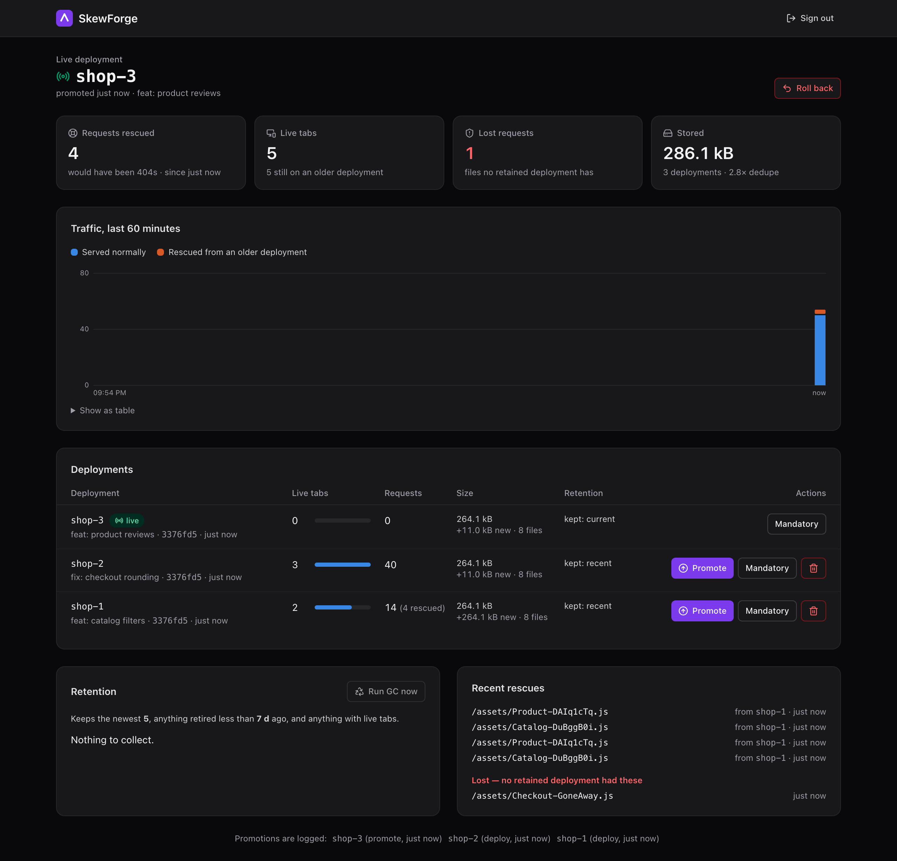
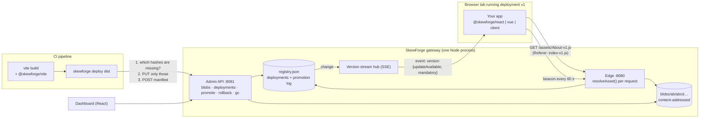

# 🧬 SkewForge

> Self-hosted version skew protection. Tabs opened before a deploy keep working after it, then move to the new version on their next click. You get the Vercel Skew Protection behaviour on any server.




---

## 🎯 Purpose

Every SPA with code splitting has this bug, and most teams only see it as noise in Sentry:

1. A user opens your app. Their tab references `Catalog-BcpERNMl.js`.
2. You deploy. The new build has `Catalog-CM1u9F4A.js`, and the old file is gone.
3. The user clicks **Catalog**. The browser requests the old chunk. Nginx's `try_files … /index.html` sends back HTML. The browser throws **`TypeError: Failed to fetch dynamically imported module`** and the page breaks.

On Vercel, **Skew Protection** fixes this by routing each client to the deployment it was built from. Outside Vercel you have to build that yourself. Teams on Docker, Kubernetes, S3 + CloudFront, or a plain VPS usually settle for "catch the error and reload", which loses whatever the user was doing.

**SkewForge is the open-source version of the full fix.** It's a small gateway that keeps every recent deployment servable and picks the right one for each request. A 2.4 kB (min+gzip) browser runtime moves users onto the new release when they were about to navigate anyway.

### Where the problem comes from

The project started from a round of forum research on what self-hosters keep hitting:

| Source | What people report |
|---|---|
| [vitejs/vite#11804](https://github.com/vitejs/vite/issues/11804) | *"Client clicks on /overview link — gets the Failed to fetch dynamically imported module error, because Overview.abc123.js no longer exists."* The thread is long-running, and the workarounds are error boundaries and forced reloads. |
| [TanStack/router#7129](https://github.com/TanStack/router/discussions/7129) | *"We're getting a noticeable amount of Sentry events from users hitting broken pages after a deploy."* |
| [vercel/next.js#88327](https://github.com/vercel/next.js/discussions/88327) | `deploymentId` / `NEXT_DEPLOYMENT_ID` for self-hosters was *"vaguely mentioned"*, with no guidance for running multiple deployments at once. |
| [vercel/next.js#48328](https://github.com/vercel/next.js/discussions/48328) | *"ChunkLoadError (critical in prod)"* on self-hosted Next.js. |
| [angular/angular#63859](https://github.com/angular/angular/issues/63859), [Shopify/hydrogen#603](https://github.com/Shopify/hydrogen/discussions/603) | The same failure in other frameworks: it comes from hashed chunks plus deploys, not from any one framework. |
| [Vercel Skew Protection](https://vercel.com/docs/skew-protection) | The reference behaviour, available on one platform only. |

The e2e suite reproduces the bug against a plain static server and then shows it gone behind SkewForge (see [Tests](#-tests)).

---

## ✨ Features

- **Every retained deployment stays servable.** Builds are stored content-addressed, so a chunk that didn't change between releases is uploaded and stored once. Three releases of the React example take 286 kB instead of 792 kB (2.8× dedupe).
- **Per-request resolution.** An explicit pin (`?dpl=`, header, or preview cookie) wins. Next comes the **Referer**: a module importing `./chunk.js` gets that chunk from the deployment that built the importer, which also works for non-fingerprinted files like `remoteEntry.js` in Module Federation. Then the current deployment, then the newest retained deployment that has the file.
- **Update on the next click, like Next.js on Vercel.** The client learns about a release over SSE (polling as fallback). From then on, the next same-origin link click or back/forward is a full page load. No banner is required, and no form state is lost in the middle of a task.
- **Mandatory releases and revoking rollbacks.** Mark a release mandatory (for example, the API changed) and older tabs reload at once. `skewforge rollback` revokes the bad build, so tabs running it are pulled off immediately.
- **Retention that knows who's still online.** Tabs send a heartbeat. Garbage collection keeps the newest N deployments, anything retired within a grace period, and **anything with live tabs**.
- **Signed previews.** Deploy without promoting, then open an HMAC-signed link. A cookie pins your browser to that build for pages *and* assets. Everyone else can't see staged builds, even with `?dpl=`.
- **Last-resort recovery.** If a chunk still goes missing (for example, it was garbage-collected), the client reloads once. A loop guard prevents repeated reloads.
- **Framework-agnostic.** The gateway injects `<meta name="skewforge-deployment">` into any HTML it serves. Bindings exist for React and Vue, there's a Vite plugin, and asset-only mode covers Next.js static files.
- **Dashboard.** Live deployment, rescued vs lost requests, live tabs per deployment, dedupe ratio, promote / rollback / mandatory / delete, and a dry-run of the next GC.

---

## 🏗 Architecture



| Package | What it does |
|---|---|
| [`packages/core`](packages/core) | Shared contracts. Zod manifest schema, `resolveAsset` / `resolveDocument`, `versionStatus`, `planRetention`. Pure functions; the gateway and the tests both run them. `@skewforge/core/protocol` has no dependencies so it can ship to browsers. |
| [`packages/server`](packages/server) | The gateway. Express 5 with two listeners: **edge** (your app, runtime endpoints under `/__skewforge`) and **admin** (API + dashboard). It has a filesystem blob store and an atomic JSON registry, and it serializes every registry mutation. |
| [`packages/cli`](packages/cli) | `skewforge deploy / promote / rollback / list / rm / gc`. It hashes the build, asks which blobs are missing, uploads only those in parallel, and bundles to one dependency-free file for CI. |
| [`packages/client`](packages/client) | The browser runtime: SSE with polling fallback, hard navigation on update, a router-guard helper, chunk-error recovery with a loop guard, and heartbeats. Its `subscribe`/`getSnapshot` pair plugs straight into `useSyncExternalStore`. |
| [`packages/react`](packages/react) | `<SkewProvider>`, `useSkew()`, `<UpdateBanner>`. |
| [`packages/vue`](packages/vue) | `createSkewForge()` plugin, `useSkew()`, `installSkewRouterGuard(router, client)`. |
| [`packages/vite`](packages/vite) | Stamps a deployment id into `index.html`, into `__SKEWFORGE_DEPLOYMENT__`, and into `.skewforge.json` for the CLI. |
| [`apps/dashboard`](apps/dashboard) | React 19 + TanStack Query + Tailwind v4 admin UI, served by the admin listener. |
| [`examples/*`](examples) | "Skew Shop" in React and in Vue, with lazy routes whose hashes change on every release. |

How a request is resolved, and why each rule is there: **[docs/how-it-works.md](docs/how-it-works.md)**.

---

## 🚀 Getting started

**Requirements:** Node 22+, npm 10+ (Docker optional).

```bash
npm install
npm run dev          # gateway: edge :8080, admin :8081 · dashboard :5173 (token: dev-admin-token)
npm run demo         # in a second terminal: builds and ships three releases of the React shop
```

`npm run demo` pauses after release 1. Open <http://localhost:8080>, press enter to ship release 2, then click **Catalog** in the tab you already had open. It loads release 1's chunk, the banner offers the update, and the next click lands on release 2. Release 3 stays staged; open its preview link from the dashboard.

### Use it in your app

```bash
npm i @skewforge/react        # or @skewforge/vue, or @skewforge/client for anything else
npm i -D @skewforge/vite @skewforge/cli
```

```ts
// vite.config.ts
import { skewforge } from '@skewforge/vite'
export default defineConfig({ plugins: [react(), skewforge()] })
```

```tsx
// main.tsx
import { SkewProvider, UpdateBanner } from '@skewforge/react'

createRoot(root).render(
  <SkewProvider>
    <UpdateBanner className="banner" />   {/* optional: the next click updates anyway */}
    <App />
  </SkewProvider>,
)
```

```ts
// Vue
const skew = createSkewForge()
installSkewRouterGuard(router, skew.client)   // router.push() becomes a full load after a release
createApp(App).use(router).use(skew).mount('#app')
```

```yaml
# CI
- run: npm run build
  env: { SKEWFORGE_DEPLOYMENT_ID: '${{ github.sha }}' }
- run: npx skewforge deploy dist --promote
  env:
    SKEWFORGE_SERVER: https://skewforge-admin.internal
    SKEWFORGE_TOKEN: ${{ secrets.SKEWFORGE_TOKEN }}
```

### Run the gateway

```bash
ADMIN_TOKEN=$(openssl rand -hex 24) docker compose up -d --build
```

Put your CDN or nginx in front of `:8080` ([deploy/nginx.conf](deploy/nginx.conf)) and keep `:8081` private.

| Variable | Default | Meaning |
|---|---|---|
| `ADMIN_TOKEN` | *(required in production)* | Bearer token for the admin API; also signs preview links. |
| `PORT` / `ADMIN_PORT` | `8080` / `8081` | Edge and admin listeners. |
| `DATA_DIR` | `.skewforge-data` | Blobs and `registry.json`. Mount a volume. |
| `PUBLIC_URL` | — | Edge origin, used in preview links. |
| `RETENTION_KEEP_LAST` | `5` | Newest deployments that are always kept. |
| `RETENTION_MIN_AGE` | `7d` | Grace period after a deployment stops being current. |
| `RETENTION_PROTECT_ACTIVE` | `true` | Never collect a deployment that still has live tabs. |
| `GC_INTERVAL` | `1h` | Automatic GC cadence (`0` disables it). |
| `SESSION_TTL` | `3m` | A tab counts as live while its last heartbeat is younger than this. |
| `SPA_FALLBACK` | `true` | Serve the entry HTML for extensionless routes. |

Using Next.js? It can keep old `/_next/static` files alive in asset-only mode. The trade-offs are covered honestly in **[docs/nextjs.md](docs/nextjs.md)**.

---

## 🧪 Tests

```bash
npm test              # 131 unit/integration tests across 8 workspaces (Vitest)
npm run test:e2e      # 7 Playwright tests: real builds, a real gateway, Chromium
npm run lint && npm run typecheck
```

The e2e suite ([e2e/skew.spec.ts](e2e/skew.spec.ts)) is the proof:

| Scenario | Plain static server | SkewForge |
|---|---|---|
| Tab opened on release 1, release 2 deployed, user clicks a lazy route | ❌ `Failed to fetch dynamically imported module` | ✅ route renders from release 1 |
| Same, but the tab is connected | — | ✅ banner, then the next click loads release 2 |
| Release 2 rolled back | — | ✅ tab is pulled back to release 1 without user action |

The last two run for both the React and the Vue example.

---

## 🗺 Roadmap

- [ ] **S3 / R2 blob store** behind the existing `BlobStore` interface, so blobs live in object storage and the gateway can scale horizontally.
- [ ] **Shared registry** (Redis or Postgres) for multi-instance gateways, reusing the change-stream pattern from [FlagForge](../FlagForge).
- [ ] **Pre-compressed blobs** (brotli/gzip stored alongside, picked by `Accept-Encoding`).
- [ ] **Next.js adapter**: set `deploymentId`, route RSC and Server Action requests by `x-deployment-id` to the matching Node deployment, not only static files.
- [ ] **Module Federation mode**: pin remotes per host deployment, and show remote version matrices in the dashboard.
- [ ] **Publish packages to npm** with built `dist` outputs (today every package exports TypeScript source inside the monorepo).
- [ ] **OIDC for the dashboard** and per-token scopes (deploy-only tokens for CI).
- [ ] **Canary promotions**: send a percentage of new sessions to a staged deployment.

---

## 📄 License

MIT © Matteo Sausto
